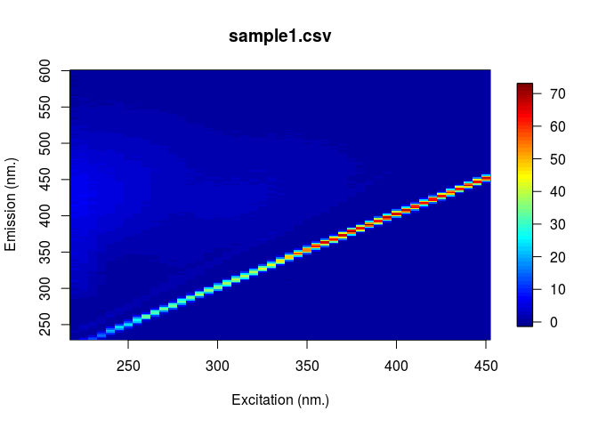
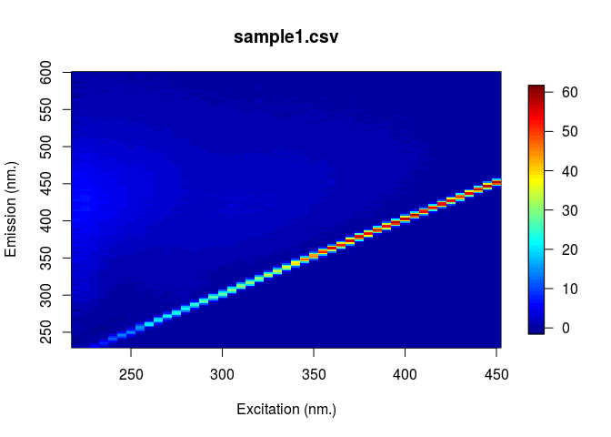
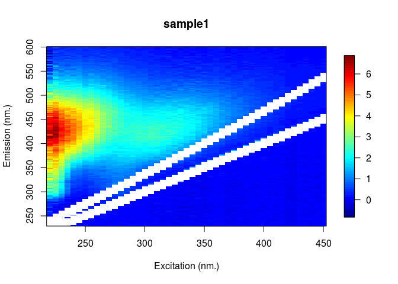
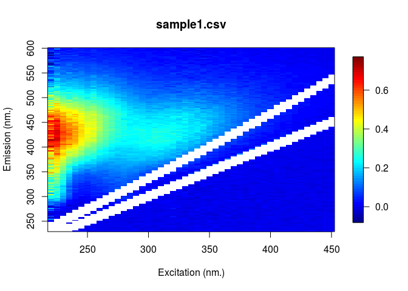
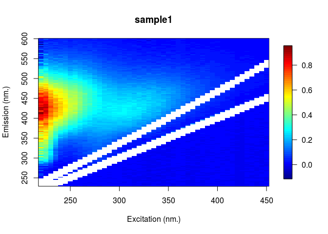

<!-- README.md is generated from README.Rmd. Please edit that file -->
| **OS**      | **Build status**                                                                                                                                                         |
|-------------|--------------------------------------------------------------------------------------------------------------------------------------------------------------------------|
| Linux & Mac | [](https://travis-ci.org/PMassicotte/eemR)                                            |
| Windows     | [](https://ci.appveyor.com/project/PMassicotte/eemR) |

EEM (excitation-emission fluorescence matrix)
=============================================

The **eemR** package implements various functions used calculate metrics from excitation-emission matrix (EEM) as well as to preform pre-processing corrections before PARAFAC analysis (Bro 1997; C. A. Stedmon and Markager 2005; Murphy et al. 2013). All functions from this package start with the `eem_` prefix.

``` r
library(eemR)
ls("package:eemR")
#>  [1] "absorbance"              "eem_biological_index"   
#>  [3] "eem_coble_peaks"         "eem_export_matlab"      
#>  [5] "eem_fluorescence_index"  "eem_humification_index" 
#>  [7] "eem_inner_filter_effect" "eem_raman_normalisation"
#>  [9] "eem_read"                "eem_remove_blank"       
#> [11] "eem_remove_scattering"
```

The package can be installed using the following command.

``` r
devtools::install_github("PMassicotte/eemR")
```

Please note this is a very alpha version of the package for testing purpose only.

Reading EEMs
============

At the moment, the following EEM types are supported:

-   Cary Eclipse `.csv` files

-   Aqualog `.dat` files

EEM can be read using the `eem_read()` function. *Please fill an [issue](https://github.com/PMassicotte/eemR/issues) if you have other file formats you would like to add to the package*.

``` r

library(eemR)

## Reading a single eem
file <- system.file("extdata/cary/eem", "sample1.csv", package = "eemR")
eem <- eem_read(file)

plot(eem)

## Reading a folder

folder <- system.file("extdata/cary/eem", package = "eemR")
eem <- eem_read(folder)

plot(eem) ## Plot the first eem
```



``` r
plot(eem, which = 2) ## Plot the second eem
```


``` r

## Aqualog EEM

folder <- system.file("extdata/aqualog", package = "eemR")
eem <- eem_read(folder)

plot(eem) ## Plot the first eem
```


Implemented metrics
===================

The current implemented metrics are:

1.  The fluorescence index (FI) developed by McKnight et al. (2001).

2.  The fluorescence peaks proposed by Coble (1996).

3.  The fluorescence humification index (HIX) by Ohno (2002).

4.  The biological fluorescence index (BIX) by Huguet et al. (2009).

``` r

library(eemR)

folder <- system.file("extdata/cary/eem", package = "eemR")
eem <- eem_read(folder)

eem_fluorescence_index(eem, verbose = FALSE)
#> Source: local data frame [3 x 2]
#> 
#>    sample       fi
#>     (chr)    (dbl)
#> 1 sample1 1.264782
#> 2 sample2 1.455333
#> 3 sample3 1.329413

eem_coble_peaks(eem, verbose = FALSE)
#> Source: local data frame [3 x 6]
#> 
#>    sample        b         t        a        m         c
#>     (chr)    (dbl)     (dbl)    (dbl)    (dbl)     (dbl)
#> 1 sample1 1.545298 1.0603312 3.731836 2.426597 1.8154222
#> 2 sample2 1.262997 0.6647042 1.584842 1.023998 0.7729534
#> 3 sample3 1.474086 1.3162812 8.416034 6.063355 6.3361907

eem_humification_index(eem, verbose = FALSE)
#> Source: local data frame [3 x 2]
#> 
#>    sample       hix
#>     (chr)     (dbl)
#> 1 sample1  6.383002
#> 2 sample2  4.252252
#> 3 sample3 13.025595

eem_humification_index(eem, verbose = FALSE, scale = TRUE)
#> Source: local data frame [3 x 2]
#> 
#>    sample       hix
#>     (chr)     (dbl)
#> 1 sample1 0.8645537
#> 2 sample2 0.8096055
#> 3 sample3 0.9287018

eem_biological_index(eem, verbose = FALSE)
#> Source: local data frame [3 x 2]
#> 
#>    sample       bix
#>     (chr)     (dbl)
#> 1 sample1 0.7062640
#> 2 sample2 0.8535423
#> 3 sample3 0.4867927
```

PARAFAC pre-processing
======================

Three types of correction are currently supported:

1.  `eem_remove_blank()` which subtract a water blank from the eem.

2.  `eem_remove_scattering()` which remove both *Raman* and *Rayleigh* scattering.

3.  `eem_raman_normalisation()` which normalize EEM fluoresence intensities (Lawaetz and Stedmon 2009).

4.  `eem_inner_filter()` which correct for both primary and secondary inner-filter effect.

Blank removal
-------------

The `eem_remove_blank()` function subtract blank (miliq) water from eem. Scatter bands can often be reduced by subtracting water blank (Murphy et al. 2013).

``` r
file <- system.file("extdata/cary/eem", "sample1.csv", package = "eemR")
eem <- eem_read(file)

file <- system.file("extdata/cary", "nano.csv", package = "eemR")
blank <- eem_read(file)

res <- eem_remove_blank(eem, blank)

plot(eem)
plot(res)
```



Removing Raman and Rayleigh scattering (1st and 2nd order)
----------------------------------------------------------

The `eem_remove_scattering()` function removes both Raman and Rayleigh scattering from EEMs.

``` r

res <- eem_remove_scattering(eem = eem, type = "raman", order = 1, width = 10)
res <- eem_remove_scattering(eem = res, type = "rayleigh", order = 1, width = 10)

plot(res)
```



Raman normalization
-------------------

The `eem_raman_normalisation()` function implement a simple calibration method for fluorescence intensity using only the integrated area of a water Raman peak. More details can be found in Lawaetz and Stedmon (2009).

``` r

res <- eem_raman_normalisation(res, blank)
#> Raman area: 9.514551

plot(res)
```



Inner-filter effect correction
------------------------------

To account for reabsorption of the light emitted by fluorophores in the water, absorbance spectra are used for correction of both primary and secondary inner filtering effects in the EEMs (Ohno 2002; Parker and Barnes 1957).

``` r
data("absorbance")

res <- eem_inner_filter_effect(eem = res, 
                               absorbance = absorbance, 
                               pathlength = 1) ## 1 cm fluo pathlenght
#> Range of IFE correction factors: 0.6432503 0.9889743

plot(res)
```



Export to Matlab
----------------

PARAFAC analysis was made easy with the fantastic Matlab [`drEEM`](http://www.models.life.ku.dk/drEEM) toolbox (Murphy et al. 2013). The function `eem_export_matlab()` can be used to export the EEMs into a `m-file` directly usable in Matlab by the `drEEM` toolbox.

``` r
folder <- system.file("extdata/cary/eem", package = "eemR")
eem <- eem_read(folder)

filename <- paste(tempfile(), ".mat", sep = "")

eem_export_matlab(filename, eem)
#> Successfully exported 3 EEMs to /tmp/RtmpQXr313/file5cef66bf67ea.mat.

## Also possible to export more than one object at time
eem_export_matlab(filename, eem, eem)
#> Successfully exported 6 EEMs to /tmp/RtmpQXr313/file5cef66bf67ea.mat.
```

Note that the name of the structure generated by the function will be `OriginalData` to *complement* with PARAFAC standard. Then, the importation into Matlab is made easy using the `load()` function. Please note that there is a bug preventing to keep matrix dimension. Simply use the `reshape()` function after you exported data.

``` matlab
load('FileName.mat');

OriginalData.X = reshape(OriginalData.X, OriginalData.nSample, OriginalData.nEm, OriginalData.nEx);

% Start PARAFAC analysis here...
```

References
==========

Bro, Rasmus. 1997. “PARAFAC. Tutorial and applications.” *Chemometrics and Intelligent Laboratory Systems* 38 (2): 149–71. [doi:10.1016/S0169-7439(97)00032-4](http://doi.org/10.1016/S0169-7439(97)00032-4).

Coble, Paula G. 1996. “Characterization of marine and terrestrial DOM in seawater using excitation-emission matrix spectroscopy.” *Marine Chemistry* 51 (4): 325–46. [doi:10.1016/0304-4203(95)00062-3](http://doi.org/10.1016/0304-4203(95)00062-3).

Huguet, A., L. Vacher, S. Relexans, S. Saubusse, J.M. Froidefond, and E. Parlanti. 2009. “Properties of fluorescent dissolved organic matter in the Gironde Estuary.” *Organic Geochemistry* 40 (6). Elsevier Ltd: 706–19. [doi:10.1016/j.orggeochem.2009.03.002](http://doi.org/10.1016/j.orggeochem.2009.03.002).

Lawaetz, A J, and C A Stedmon. 2009. “Fluorescence Intensity Calibration Using the Raman Scatter Peak of Water.” *Applied Spectroscopy* 63 (8): 936–40. [doi:10.1366/000370209788964548](http://doi.org/10.1366/000370209788964548).

McKnight, Diane M., Elizabeth W. Boyer, Paul K. Westerhoff, Peter T. Doran, Thomas Kulbe, and Dale T. Andersen. 2001. “Spectrofluorometric characterization of dissolved organic matter for indication of precursor organic material and aromaticity.” *Limnology and Oceanography* 46 (1). American Society of Limnology; Oceanography: 38–48. [doi:10.4319/lo.2001.46.1.0038](http://doi.org/10.4319/lo.2001.46.1.0038).

Murphy, Kathleen R., Colin a. Stedmon, Daniel Graeber, and Rasmus Bro. 2013. “Fluorescence spectroscopy and multi-way techniques. PARAFAC.” *Analytical Methods* 5 (23): 6557. [doi:10.1039/c3ay41160e](http://doi.org/10.1039/c3ay41160e).

Ohno, Tsutomu. 2002. “Fluorescence Inner-Filtering Correction for Determining the Humification Index of Dissolved Organic Matter.” *Environmental Science & Technology* 36 (4): 742–46. [doi:10.1021/es0155276](http://doi.org/10.1021/es0155276).

Parker, C. a., and W. J. Barnes. 1957. “Some experiments with spectrofluorimeters and filter fluorimeters.” *The Analyst* 82 (978): 606. [doi:10.1039/an9578200606](http://doi.org/10.1039/an9578200606).

Stedmon, Colin A, and Stiig Markager. 2005. “Resolving the variability in dissolved organic matter fluorescence in a temperate estuary and its catchment using PARAFAC analysis.” *Limnology and Oceanography* 50 (2): 686–97. [doi:10.4319/lo.2005.50.2.0686](http://doi.org/10.4319/lo.2005.50.2.0686).
