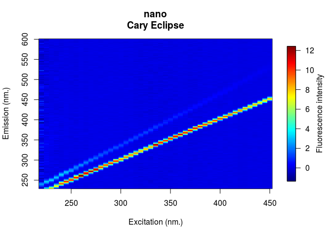
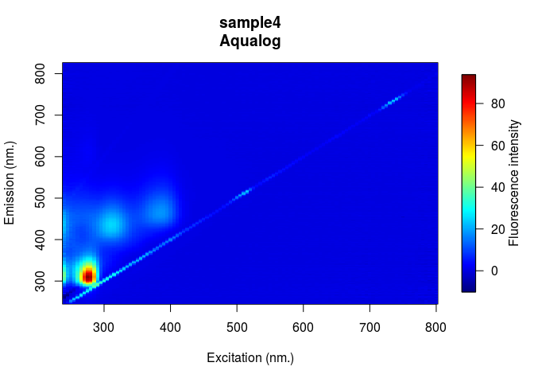
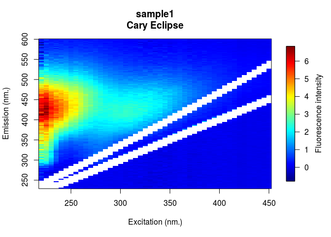

<!-- README.md is generated from README.Rmd. Please edit that file -->
eemR [](https://travis-ci.org/PMassicotte/eemR) [](https://ci.appveyor.com/project/PMassicotte/eemR) [](http://www.gnu.org/licenses/gpl-2.0.html) [](http://cran.rstudio.com/package=eemR) [](http://www.r-pkg.org/pkg/eemR)
---------------------------------------------------------------------------------------------------------------------------------------------------------------------------------------------------------------------------------------------------------------------------------------------------------------------------------------------------------------------------------------------------------------------------------------------------------------------------------------------------------------------------------------------------------------------------------------------------------------------------------------------------------------------

The **eemR** package implements various functions used calculate metrics from excitation-emission matrix (EEM) as well as to preform pre-processing corrections before PARAFAC analysis (Bro 1997; C. A. Stedmon and Markager 2005; Murphy et al. 2013). All functions from this package start with the `eem_` prefix.

``` r
library(eemR)
ls("package:eemR")
#>  [1] "absorbance"              "eem_bind"               
#>  [3] "eem_biological_index"    "eem_coble_peaks"        
#>  [5] "eem_cut"                 "eem_export_matlab"      
#>  [7] "eem_extract"             "eem_fluorescence_index" 
#>  [9] "eem_humification_index"  "eem_inner_filter_effect"
#> [11] "eem_raman_normalisation" "eem_read"               
#> [13] "eem_remove_blank"        "eem_remove_scattering"  
#> [15] "eem_sample_names"        "eem_sample_names<-"     
#> [17] "eem_set_wavelengths"
```

The lastest release of the package from CRAN can be installed with:

``` r
install.packages("eemR")
```

The lastest development version of the package can be installed with:

``` r
devtools::install_github("PMassicotte/eemR")
```

Reading EEMs
============

At the moment, the following EEM types are supported:

-   Cary Eclipse `.csv` files

-   Aqualog `.dat` files

-   Shimadzu `.TXT` files

EEM can be read using the `eem_read()` function. *Please fill an [issue](https://github.com/PMassicotte/eemR/issues) if you have other file formats you would like to add to the package*.

At the moment I need files from:

-   FluoromaxIII

-   Perkin elmer

-   Hitachi

``` r

library(eemR)

# Reading a single eem
file <- system.file("extdata/cary/eem", "sample1.csv", package = "eemR")
eem <- eem_read(file)

plot(eem)

# Reading a folder
folder <- system.file("extdata/cary/eem", package = "eemR")
eem <- eem_read(folder)

eem_sample_names(eem)
#> [1] "sample1" "sample2" "sample3"

plot(eem) # Plot the first eem
```

<!-- -->

``` r
plot(eem, which = 2) # Plot the second eem
```

<!-- -->

``` r

# Aqualog EEM
folder <- system.file("extdata/aqualog", package = "eemR")
eem <- eem_read(folder)

plot(eem) # Plot the first eem
```

<!-- -->

Shimadzu files
==============

Some spectrophotometers (such as Shimadzu) do not include excitation wavelengths in the fluorescence files. In these cases, we can use the `eem_set_wavelengths()` function to manually provide vectors of emission and/or excitation wavelengths.

``` r
folder <- system.file("extdata/shimadzu", package = "eemR")
eems <- eem_read(folder)
#> Shimadzu files do not contain excitation wavelengths.
#> Please provide them using the eem_set_wavelengths() function.

eems <- eem_set_wavelengths(eems, ex = seq(230, 450, by = 5))
```

Manipulating EEMs
=================

Extracting and removing EEMs
----------------------------

Extracting of removing EEMs can be useful when reading a bunch of files containing both measurements and blank fluorescence. This can be done easily using `eem_extract()`. For example, lets read a whole folder and then remove the blank water.

``` r
folder <- system.file("extdata/cary", package = "eemR")

eems <- eem_read(folder, recursive = TRUE)

blank <- eem_extract(eems, "nano", remove = FALSE)
#> Extracted sample(s): nano

eems <- eem_extract(eems, "nano", remove = TRUE)
#> Removed sample(s): nano


# Remove sample 1 to 3
res <- eem_extract(eems, 1:3, remove = TRUE)
#> Removed sample(s): sample1 sample2 sample3
```

Changing sample names
---------------------

``` r
folder <- system.file("extdata/cary/eem", package = "eemR")
eem <- eem_read(folder)

eem_sample_names(eem)
#> [1] "sample1" "sample2" "sample3"

eem_sample_names(eem) <- c("A", "B", "C")

eem_sample_names(eem)
#> [1] "A" "B" "C"
```

Implemented metrics
===================

The current implemented metrics are:

1.  The fluorescence index (FI) developed by McKnight et al. (2001).

2.  The fluorescence peaks proposed by Coble (1996).

3.  The fluorescence humification index (HIX) by Ohno (2002).

4.  The biological fluorescence index (BIX) by Huguet et al. (2009).

``` r

library(eemR)

folder <- system.file("extdata/cary/eem", package = "eemR")
eem <- eem_read(folder)

eem_fluorescence_index(eem, verbose = FALSE)
#> Source: local data frame [3 x 2]
#> 
#>    sample       fi
#>     (chr)    (dbl)
#> 1 sample1 1.264782
#> 2 sample2 1.455333
#> 3 sample3 1.329413

eem_coble_peaks(eem, verbose = FALSE)
#> Source: local data frame [3 x 6]
#> 
#>    sample        b         t        a        m         c
#>     (chr)    (dbl)     (dbl)    (dbl)    (dbl)     (dbl)
#> 1 sample1 1.545298 1.0603312 3.731836 2.424096 1.8149415
#> 2 sample2 1.262997 0.6647042 1.583489 1.023593 0.7709074
#> 3 sample3 1.474086 1.3162812 8.416034 6.063355 6.3179129

eem_humification_index(eem, verbose = FALSE)
#> Source: local data frame [3 x 2]
#> 
#>    sample       hix
#>     (chr)     (dbl)
#> 1 sample1  6.379562
#> 2 sample2  4.254848
#> 3 sample3 13.024623

eem_humification_index(eem, verbose = FALSE, scale = TRUE)
#> Source: local data frame [3 x 2]
#> 
#>    sample       hix
#>     (chr)     (dbl)
#> 1 sample1 0.8644906
#> 2 sample2 0.8096995
#> 3 sample3 0.9286968

eem_biological_index(eem, verbose = FALSE)
#> Source: local data frame [3 x 2]
#> 
#>    sample       bix
#>     (chr)     (dbl)
#> 1 sample1 0.7062640
#> 2 sample2 0.8535423
#> 3 sample3 0.4867927
```

PARAFAC pre-processing
======================

Three types of correction are currently supported:

1.  `eem_remove_blank()` which subtract a water blank from the eem.

2.  `eem_remove_scattering()` which remove both *Raman* and *Rayleigh* scattering.

3.  `eem_raman_normalisation()` which normalize EEM fluorescence intensities (Lawaetz and Stedmon 2009).

4.  `eem_inner_filter()` which correct for both primary and secondary inner-filter effect.

Blank removal
-------------

The `eem_remove_blank()` function subtract blank (miliq) water from eem. Scatter bands can often be reduced by subtracting water blank (Murphy et al. 2013).

``` r
file <- system.file("extdata/cary/eem", "sample1.csv", package = "eemR")
eem <- eem_read(file)

file <- system.file("extdata/cary", "nano.csv", package = "eemR")
blank <- eem_read(file)

res <- eem_remove_blank(eem, blank)

plot(eem)
plot(res)
```


Removing Raman and Rayleigh scattering (1st and 2nd order)
----------------------------------------------------------

The `eem_remove_scattering()` function removes both Raman and Rayleigh scattering from EEMs.

``` r

res <- eem_remove_scattering(eem = eem, type = "raman", order = 1, width = 10)
res <- eem_remove_scattering(eem = res, type = "rayleigh", order = 1, width = 10)

plot(res)
```

<!-- -->

Raman normalization
-------------------

The `eem_raman_normalisation()` function implement a simple calibration method for fluorescence intensity using only the integrated area of a water Raman peak. More details can be found in Lawaetz and Stedmon (2009).

``` r
res <- eem_raman_normalisation(res, blank)
#> Raman area: 9.501974

plot(res)
```

<!-- -->

Inner-filter effect correction
------------------------------

To account for reabsorption of the light emitted by fluorophores in the water, absorbance spectra are used for correction of both primary and secondary inner filtering effects in the EEMs (Ohno 2002; Parker and Barnes 1957; Kothawala et al. 2013).

``` r
data("absorbance")

res <- eem_inner_filter_effect(eem = res,
                               absorbance = absorbance,
                               pathlength = 1) # 1 cm fluo pathlenght
#> Range of IFE correction factors: 0.6433 0.989 
#> Range of total absorbance (Atotal) : 0.0096 0.3832

plot(res)
```

<!-- -->

### Name matching

The names of `absorbance` variables are expected to match those of the eems. If the appropriate absorbance spectrum is not found, an uncorrected eem will be returned and a warning message will be printed.

### Sample dilution

Kothawala et al. (2013) have shown that a 2-fold dilution was required for samples presenting total absorbance &gt; 1.5. Accordingly, a message will warn the user if total absorbance is greater than this threshold.

Export to Matlab
----------------

PARAFAC analysis was made easy with the fantastic Matlab [`drEEM`](http://www.models.life.ku.dk/drEEM) toolbox (Murphy et al. 2013). The function `eem_export_matlab()` can be used to export the EEMs into a `m-file` directly usable in Matlab by the `drEEM` toolbox.

``` r
folder <- system.file("extdata/cary/eem", package = "eemR")
eem <- eem_read(folder)

filename <- paste(tempfile(), ".mat", sep = "")

eem_export_matlab(filename, eem)
#> Successfully exported 3 EEMs to /tmp/Rtmp17be2y/file3cad6ef213b4.mat.

# It is also possible to export more than one object at time
eem_export_matlab(filename, eem, eem)
#> Successfully exported 6 EEMs to /tmp/Rtmp17be2y/file3cad6ef213b4.mat.
```

Note that the name of the structure generated by the function will be `OriginalData` to *complement* with PARAFAC standard. Then, the importation into Matlab is made easy using the `load()` function. Please note that there is a bug preventing to keep matrix dimension. Simply use the `reshape()` function after you exported data.

``` matlab
load('FileName.mat');

OriginalData.X = reshape(OriginalData.X, ...
    OriginalData.nSample, ...
    OriginalData.nEm, ...
    OriginalData.nEx);

% Start PARAFAC analysis here...
```

References
==========

Bro, Rasmus. 1997. “PARAFAC. Tutorial and applications.” *Chemometrics and Intelligent Laboratory Systems* 38 (2): 149–71. doi:[10.1016/S0169-7439(97)00032-4](https://doi.org/10.1016/S0169-7439(97)00032-4).

Coble, Paula G. 1996. “Characterization of marine and terrestrial DOM in seawater using excitation-emission matrix spectroscopy.” *Marine Chemistry* 51 (4): 325–46. doi:[10.1016/0304-4203(95)00062-3](https://doi.org/10.1016/0304-4203(95)00062-3).

Huguet, A., L. Vacher, S. Relexans, S. Saubusse, J.M. Froidefond, and E. Parlanti. 2009. “Properties of fluorescent dissolved organic matter in the Gironde Estuary.” *Organic Geochemistry* 40 (6). Elsevier Ltd: 706–19. doi:[10.1016/j.orggeochem.2009.03.002](https://doi.org/10.1016/j.orggeochem.2009.03.002).

Kothawala, Dolly N., Kathleen R. Murphy, Colin A. Stedmon, Gesa A. Weyhenmeyer, and Lars J. Tranvik. 2013. “Inner filter correction of dissolved organic matter fluorescence.” *Limnology and Oceanography: Methods* 11 (12): 616–30. doi:[10.4319/lom.2013.11.616](https://doi.org/10.4319/lom.2013.11.616).

Lawaetz, A J, and C A Stedmon. 2009. “Fluorescence Intensity Calibration Using the Raman Scatter Peak of Water.” *Applied Spectroscopy* 63 (8): 936–40. doi:[10.1366/000370209788964548](https://doi.org/10.1366/000370209788964548).

McKnight, Diane M., Elizabeth W. Boyer, Paul K. Westerhoff, Peter T. Doran, Thomas Kulbe, and Dale T. Andersen. 2001. “Spectrofluorometric characterization of dissolved organic matter for indication of precursor organic material and aromaticity.” *Limnology and Oceanography* 46 (1). American Society of Limnology; Oceanography: 38–48. doi:[10.4319/lo.2001.46.1.0038](https://doi.org/10.4319/lo.2001.46.1.0038).

Murphy, Kathleen R., Colin a. Stedmon, Daniel Graeber, and Rasmus Bro. 2013. “Fluorescence spectroscopy and multi-way techniques. PARAFAC.” *Analytical Methods* 5 (23): 6557. doi:[10.1039/c3ay41160e](https://doi.org/10.1039/c3ay41160e).

Ohno, Tsutomu. 2002. “Fluorescence Inner-Filtering Correction for Determining the Humification Index of Dissolved Organic Matter.” *Environmental Science & Technology* 36 (4): 742–46. doi:[10.1021/es0155276](https://doi.org/10.1021/es0155276).

Parker, C. a., and W. J. Barnes. 1957. “Some experiments with spectrofluorimeters and filter fluorimeters.” *The Analyst* 82 (978): 606. doi:[10.1039/an9578200606](https://doi.org/10.1039/an9578200606).

Stedmon, Colin A, and Stiig Markager. 2005. “Resolving the variability in dissolved organic matter fluorescence in a temperate estuary and its catchment using PARAFAC analysis.” *Limnology and Oceanography* 50 (2): 686–97. doi:[10.4319/lo.2005.50.2.0686](https://doi.org/10.4319/lo.2005.50.2.0686).
