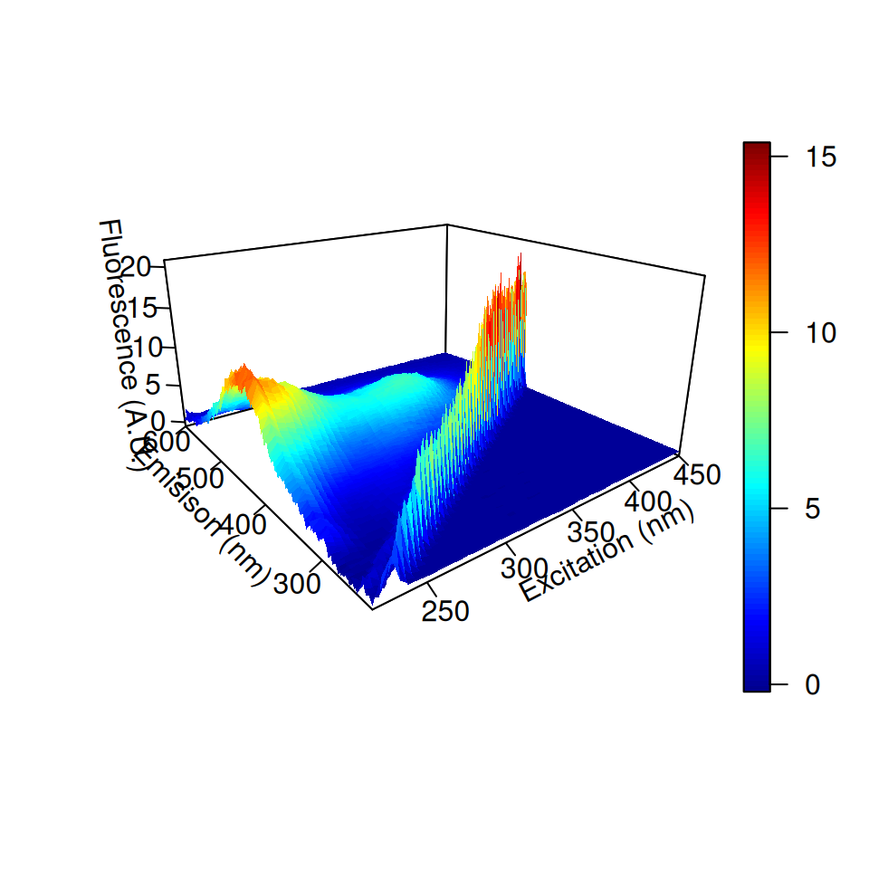
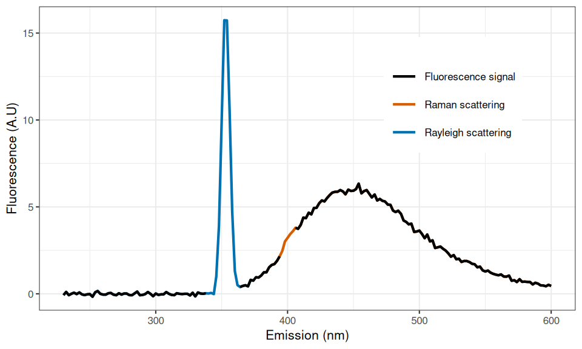
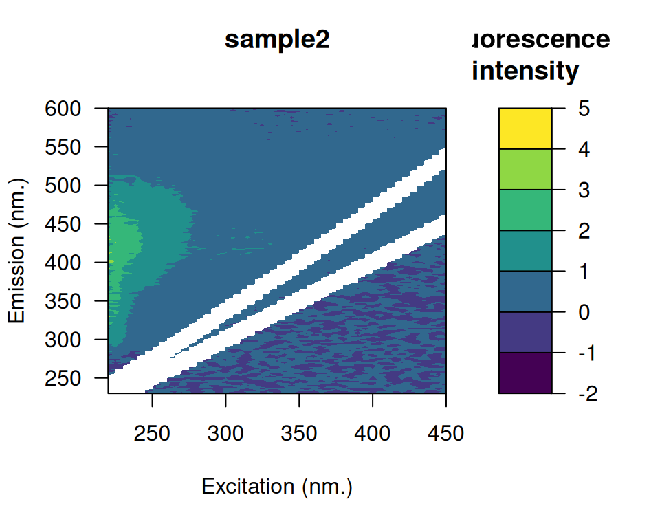

# Introduction to eemR

## Introduction

Dissolved organic matter (DOM) plays a central role in the functioning
of aquatic ecosystems. For example, characteristics of the DOM pool
(quantity and quality) determine underwater light climate ([Kirk
1994](#ref-Kirk1994)), the composition of aquatic microbial communities
([Foreman and Covert 2003](#ref-Foreman2003); [Kritzberg et al.
2006](#ref-Kritzberg2006a)) and the carbon cycling on local to global
scales ([Cole et al. 2007](#ref-Cole2007)). Chemically, the DOM pool is
complex (\> 1500 compounds) and analytical methods used to characterize
it are relatively complex, time-consuming and costly ([Benner
2002](#ref-Benner2002); [Seitzinger et al. 2005](#ref-Seitzinger2005);
[Fellman, Hood, and Spencer 2010](#ref-Fellman2010)). This situation
called for the development of rapid and cost effective characterization
techniques. Because optical properties of DOM can be related to its
chemical properties, optical techniques such as fluorescence
spectroscopy have been developed and rapidly adopted by the community to
characterize the DOM pool in aquatic ecosystems ([Paula G. Coble et al.
1990](#ref-Coble1990); [Paula G. Coble 1996](#ref-Coble1996); [McKnight
et al. 2001](#ref-McKnight2001)).

The seminal paper of ([Stedmon, Markager, and Bro
2003](#ref-Stedmon2003a)) put at the forefront the use of parallel
factor analysis (PARAFAC) to aid the characterization of fluorescent
DOM. Briefly, this three-way technique allows the decomposition of
complex DOM fluorescence signals contained in the excitation-emission
matrix (EEM, Fig. 1) into a set of individual chemical components and
provides estimations of their relative contribution to the total
fluorescence ([Bro 1997](#ref-Bro1997); [Fellman, Hood, and Spencer
2010](#ref-Fellman2010); [Stedmon, Markager, and Bro
2003](#ref-Stedmon2003a)).



Example of an excitation-emission fluorescence matrix (EEM). The
diagonal structure with high fluorescence corresponds to the first order
of Rayleigh scattering.

The PARAFAC model is described as ([Bro 1997](#ref-Bro1997); [Harshman
1970](#ref-Harshman1970)):

1.  $$x_{ijk} = \sum\limits_{f = 1}^{F}a_{ij}b_{jf}c_{kf} + e_{ijk}$$

where $i = 1,...,I$; $j = 1,...,J$; $k = 1,...,K$, $x_{ijk}$ is the
intensity of fluorescence of the the $i^{th}$ sample at the $j^{th}$
emission wavelength at the $k^{th}$ excitation wavelength. $a_{ij}$ is
directly proportional to the concentration of the $f^{th}$ component in
the sample $i$. Although PARAFAC gained a lot of attention in
environmental sciences, it is also widely used in other research fields
such as medical, pharmaceutical, food, social and information sciences
([Murphy et al. 2013](#ref-Murphy2013)). Until today, more than 1850
published scientific papers relying on PARAFAC have been identified on
Web of Science.

Although PARAFAC was made easier using the MATLAB toolbox ([Murphy et
al. 2013](#ref-Murphy2013)), preprocessing of EEMs prior to the analysis
is still not straightforward. EEM preprocessing is an important part of
PARAFAC since it aims to correct any systematic bias in the measurements
and to remove signal unrelated to DOM fluorescence ([Murphy et al.
2013](#ref-Murphy2013)). Biased models can be produced if these steps
are not conducted carefully (see Hiriart-Baer, Diep, and Smith
([2008](#ref-Hiriart-Baer2008)) where scattering fluorescence signals
have been modeled and wrongly interpreted). Such data processing is
cumbersome as it involves many steps ([Stedmon and Bro
2008](#ref-Stedmon2008); [Murphy et al. 2013](#ref-Murphy2013)) which
are usually executed by hand or within in-house scripting and therefore
prone to introduce errors. Another important drawback limiting effective
preprocessing of EEMs arise from the wide variety of file formats
provided by the different manufacturers of spectrofluorometers that
makes data importation difficult to generalize.

Possibly reflecting these difficulties, it was recently pointed out that
characterization of DOM using fluorescence spectroscopy is still not
routinely included in ecological studies ([Fellman, Hood, and Spencer
2010](#ref-Fellman2010)). Given the increasing interest for fluorescence
spectroscopy in ecology, tools are needed to unify the main
preprocessing steps needed for further analyzes such as PARAFAC or
metric calculations. The purpose of the package is to provide a rapid
and an elegant interface to perform preprocessing of EEMs as well as to
extract common fluorescence-based metrics proposed in the literature to
obtain quantitative information about the DOM pool. This paper presents
theoretical and mathematical background of the main PARAFAC
preprocessing steps and metric calculations with concrete code examples.

## Fluorescence of DOM: theoretical and mathematical background

Let us define $X$, an EEM of fluorescence intensities measured along a
vector of excitation wavelengths ($ex$) at emission wavelengths ($em$).
Usually, $ex$ and $em$ vary, respectively, between 200-500 nm and
220-600 nm (Fig. 1). $X_{ex,em}$ denotes the fluorescence intensity
measured at excitation $ex$ and emission $em$ (ex.: $X_{250,400}$).

The following sections present the main correction steps for
fluorescence data aiming to correct any systematic bias in the
measurements and remove signal unrelated to fluorescence prior to any
analysis.

| Correction                     |                                                        Description                                                        |
|--------------------------------|:-------------------------------------------------------------------------------------------------------------------------:|
| Blank subtraction              | Subtract a pure water sample blank from the fluorescence data to help the removal of Raman and Rayleigh scattering peaks. |
| Scattering removal             |       Remove the the so-called scattering bands caused by first and second order of Raman and Rayleigh scattering.        |
| Inner-filter effect correction |      Correct for reabsorption of light occurring at both the excitation and emission wavelengths during measurement.      |
| Raman normalization            |  Remove the dependency of fluorescence intensities from the measuring equipments thus allowing cross-study comparisons.   |

### Scattering correction

Rayleigh and Raman scattering are optical processes by which some of the
incident energy can be absorbed and converted into vibrational and
rotational energy ([Lakowicz 2006](#ref-Lakowicz2006)). The resulting
scattered energy produce the so-called scattering bands which are
visually easily identifiable (Figs. 1 and 2). Given that both types of
scattering are repeated across EEMs, it is important to remove such
artifacts prior to analysis ([Bahram et al. 2006](#ref-Bahram2006);
[Zepp, Sheldon, and Moran 2004](#ref-Zepp2004)).



Emission fluorescence emitted at excitation $ex = 350$. First order of
Rayleigh and Raman scattering regions are identified in blue and red.

First order of Rayleigh scattering is defined as the region where
emission is equal to excitation ($em = ex$) causing a diagonal band in
the EEM (Fig. 1) whereas the second order of Rayleigh scattering occurs
at two times the emission wavelength of the primary peak ($em = 2ex$).
For water, Raman scattering occurs at a wavenumber 3 600 $cm^{-1}$ (or
$3.6 \times 10^{10}nm^{-1}$) lower than the incident excitation
wavenumber ([Lakowicz 2006](#ref-Lakowicz2006)). Mathematically, first
order Raman scattering is defined as follow:

2.  $$\text{Raman}_{\text{1st}} = -\frac{ex}{0.00036ex - 1}$$

where $ex$ is the incident excitation wavelength (nm). Second order
Raman scattering is then simply defined as:

3.  $$\text{Raman}_{\text{2nd}} = -\frac{2ex}{0.00036ex - 1}$$

Different interpolation techniques have been proposed to eliminate
scattering ([Zepp, Sheldon, and Moran 2004](#ref-Zepp2004); [Bahram et
al. 2006](#ref-Bahram2006)). However, it is a common practice to simply
remove the scattering-bands by inserting missing values (Fig. 3) at the
corresponding positions ([Murphy et al. 2013](#ref-Murphy2013); [Stedmon
and Bro 2008](#ref-Stedmon2008)).

### Inner-filter effect correction

The inner-filter effect (IFE) is an optical phenomenon of reabsorption
of emitted light and occurs particularly in highly concentrated samples
(Fig. 4). IFE is known to cause underestimation of fluorescence
intensities especially at shorter wavelengths and even to alter the
shape and the positioning of fluorescence spectra by shifting peak
positions toward lower wavelengths (Fig. 4) with increasing
concentration ([Mobed et al. 1996](#ref-Mobed1996); [Kothawala et al.
2013](#ref-Kothawala2013)). However, it was shown that the loss of
fluorescence due to IFE could be estimated from absorbance spectra
measured on the same sample using Equation (4) ([Ohno
2002](#ref-Ohno2002); [Parker and Barnes 1957](#ref-Parker1957)):

4.  $$X_{0} = \frac{X}{10^{-b{(A_{ex} + A_{em})}}}$$

where $X_{0}$ is the fluorescence in the absence of IFE, $X$ is the
measured fluorescence intensity, $b$ is half the cuvette pathlength
(usually 0.5 cm) for excitation and emission absorbance, $A_{ex}$ is the
absorbance at the excitation wavelength $ex$ and $A_{em}$ the absorbance
at the emission wavelength $em$ (Fig. 4B).


Surface plot of an EEM with first order of Raman and Rayleigh scattering
removed. Missing values (`NA`) have been placed in both diagonals using
a bandwidth of 10 nm.

It was recently shown that IFE corrected algebraically was not
appropriate when total absorbance, defined as
$A_{\text{total}} = A_{\text{ex}} + A_{\text{em}}$ (see Equation (4)),
is greater than 1.5 ([Kothawala et al. 2013](#ref-Kothawala2013)). Under
this circumstance, a two-fold dilution of the sample has been
recommended. If this happen, a warning message will be displayed by the
package during the correction process.

### Raman calibration

The same DOM sample measured on different spectrofluorometers (or even
the same but with different settings) can give important differences in
fluorescence intensities ([Lawaetz and Stedmon 2009](#ref-Lawaetz2009);
[Paula G. Coble, Schultz, and Mopper 1993](#ref-Coble1993)). The purpose
of the Raman calibration is to remove the dependency of fluorescence
intensities on the measuring equipment, thus allowing cross-study
comparisons. Given that the Raman peak position of a water sample is
located at a fixed position, ([Lawaetz and Stedmon
2009](#ref-Lawaetz2009)) proposed to use the Raman integral of a
blank-water sample measured the same day as the EEM to perform
calibration. Moreover, the area of the Raman peak ($A_{\text{rp}}$, Fig.
5) is defined as the area of the emission profile between 371 and 428 nm
at a fixed excitation of 350 nm ([Lawaetz and Stedmon
2009](#ref-Lawaetz2009)).


IFE correction process. Panel (A) shows an uncorrected EEM (the color
bar is the florescence intensity in A.U.). Panel (B) is the
corresponding absorbance spectra measured on the same sample. Panel (C)
shows the IFE correction factors corresponding to the values of the
denominator in Equation (4) with values close to 1 indicating less
pronounced correction. Panel (D) shows the corrected sample (the color
bar is the fluorescence intensity in A.U.).

Mathematically, the value of $A_{\text{rp}}$ is calculated using the
following integral (Equation(5)):

5.  $$A_{\text{rp}} = \int\limits_{\lambda_{\text{em}371}}^{\lambda_{\text{em}428}}W_{350,\lambda}d\lambda$$

where $W_{350,\lambda}$ is the fluorescence intensity of a pure water
sample (preferably deionized and ultraviolet exposed, Lawaetz and
Stedmon ([2009](#ref-Lawaetz2009))) at excitation $ex = 350$ nm and at
emission $em = \lambda$ nm. Each values of the EEM $X$ are then
normalized using the scalar value of $A_{\text{rp}}$ accordingly to
Equation (6):

6.  $$X_{0} = \frac{X}{A_{\text{rp}}}$$

where $X_{0}$ is the normalized EEM with fluorescence intensities now
expressed as Raman Units (R.U.), $X$ are the unnormalized measured
fluorescence intensities and $A_{\text{rp}}$ is the Raman peak area.

### Metrics

A wide range of different metrics obtained from EEMs have been proposed
to characterize the DOM pool in aquatic ecosystems. These metrics
extract quantitative information in specific regions (wavelengths) in
EEMs. The following sections present an overview of the principal
metrics supported by the package.

#### Coble’s peaks

The following table presents the five major fluorescent components
identified by ([Paula G. Coble 1996](#ref-Coble1996)) in marine EEMs.
Peaks **B** and **T** represent protein-like compounds (tyrosine and
tryptophane), peaks **A** and **C** are indicators of humic-like
components whereas peak **M** was associated to marine humic-like
fluorescence.

| Peak | Ex (nm) | Em (nm) |
|------|---------|---------|
| B    | 275     | 310     |
| T    | 275     | 340     |
| A    | 260     | 380-460 |
| M    | 312     | 380-420 |
| C    | 350     | 420-480 |

#### Fluorescence, humification and biological indices

Three main indices have been proposed to trace the diagnostic state of
the DOM pool in aquatic ecosystems. The fluorescence index (FI) was
shown to be a good indicator of the general source and aromaticity of
DOM in lakes, streams and rivers ([McKnight et al.
2001](#ref-McKnight2001)). This index is calculated as the ratio of
fluorescence at emission 450 nm and 500 nm, at fixed excitation of 370
nm (Equation (7)).

7.  $$\text{FI} = \frac{X_{370,450}}{X_{370,500}}$$

The humification index (HIX) is a measure of the complexity and the
aromatic nature of DOM ([Ohno 2002](#ref-Ohno2002)). HIX calculated as
the ratio of the sum of the fluorescence between 435 and 480 nm and
between 300 and 345 nm at a fixed excitation of 254 nm (Equation (8)).

8.  $$\text{HIX} = \frac{\sum\limits_{em = 435}^{480}X_{254,em}}{\sum\limits_{em = 300}^{345}X_{254,em}}$$

The biological index (BIX) is a measure to characterize biological
production of DOM ([Huguet et al. 2009](#ref-Huguet2009)). BIX is
calculated at excitation 310 nm, by dividing the fluorescence intensity
emitted at emission 380 nm and at 430 nm (Equation (9)).

9.  $$\text{BIX} = \frac{X_{310,380}}{X_{310,430}}$$

## R code and study case

Main preprocessing steps using the **eemR** package are illustrated
using a subset of three EEMs from ([Massicotte and Frenette
2011](#ref-Massicotte2011EA)). Briefly, these EEMs (see Fig. 1 for an
example) have been sampled in the St. Lawrence River, one of the largest
rivers in North America. Fluorescence matrices of DOM were measured on a
Cary Eclipse spectrofluorometer (Varian, Mississauga, Ontario, Canada)
over excitation wavelengths between 220 and 450 nm (5-nm increment) and
emission wavelengths between 230 and 600 nm (2-nm increment). All
functions from the package start with the prefix `'eem_'`.

``` r
library(eemR)
ls("package:eemR")
#>  [1] "absorbance"              "eem_bind"               
#>  [3] "eem_biological_index"    "eem_coble_peaks"        
#>  [5] "eem_cut"                 "eem_export_matlab"      
#>  [7] "eem_extract"             "eem_fluorescence_index" 
#>  [9] "eem_humification_index"  "eem_inner_filter_effect"
#> [11] "eem_names"               "eem_names<-"            
#> [13] "eem_peaks"               "eem_raman_normalisation"
#> [15] "eem_read"                "eem_remove_blank"       
#> [17] "eem_remove_scattering"   "eem_set_wavelengths"
```

### Data importation and plotting

Importation of EEMs into is done using the
[`eem_read()`](http://pmassicotte.github.io/eemR/reference/eem_read.md)
function. Given that fluorescence files are dependent on the
spectrofluorometer used, will determine automatically from which
manufacturer the files are from and load them accordingly.

``` r
file <- system.file("extdata/cary/scans_day_1", package = "eemR")
eems <- eem_read(file, import_function = "cary")
```

The generic [`summary()`](https://rdrr.io/r/base/summary.html) function
displays useful information such as: (1) the wavelength ranges used in
both emission and excitation modes, (2) the manufacturer from which the
file was read and (3) the state of the EEM which indicate which
corrections have been applied.

``` r
summary(eems)
#>    sample ex_min ex_max em_min em_max is_blank_corrected is_scatter_corrected
#> 1    nano    220    450    230    600              FALSE                FALSE
#> 2 sample1    220    450    230    600              FALSE                FALSE
#> 3 sample2    220    450    230    600              FALSE                FALSE
#> 4 sample3    220    450    230    600              FALSE                FALSE
#>   is_ife_corrected is_raman_normalized
#> 1            FALSE               FALSE
#> 2            FALSE               FALSE
#> 3            FALSE               FALSE
#> 4            FALSE               FALSE
```

A surface plot of EEMs is made using the `plot(x, which = 1)` function
where `which` is the index of the EEM to be plotted (see Fig. 3).

``` r
plot(eems, which = 3L)
```

Interactive plots using a simple shiny app can be lunched to
interactively browse EEMs.

``` r
plot(eems, interactive = TRUE)
```

### Blank subtraction

Subtraction of a water blank from the measured samples may help to
reduce scattering ([Murphy et al. 2013](#ref-Murphy2013); [Stedmon and
Bro 2008](#ref-Stedmon2008)). In , this is done using the
`eem_remove_blank(eem, blank)` function where `eem` is a list of EEMs
and `blank` is a water blank.

``` r
file <- system.file("extdata/cary/scans_day_1", "nano.csv", package = "eemR")
blank <- eem_read(file, import_function = "cary")

eems <- eem_remove_blank(eems, blank)
```

### Raman and Rayleigh scattering removal

Scattering removal (Equation (2) and Equation (3)) is performed using
the `eem_remove_scattering(eem, type, order, width)` function where
`eem` is a list of EEMs, `type` is the scattering type (`raman` or
`rayleigh`), `order` is the order of the scattering (1 or 2) and `width`
the width in nanometers of the slit windows to be removed. In the
following example, only first order and Raman and Rayleigh scattering
are removed using a bandwidth of 10 nm (Fig. 3).

``` r
eems <- eem_remove_scattering(eems, "rayleigh", 1L, 10L) |>
  eem_remove_scattering("raman", 1L, 10L)

plot(eems, which = 3L)
```



Fluorescence profile of a pure water sample at excitation 350 nm between
300 and 450 nm emission. The area of the Raman peak is identified by the
shaded polygon and is calculated using Equation (5).

### Inner-filter effect correction

IFE correction requires the use of absorbance data (Equation (4)). For
each EEM, an absorbance spectra must be supplied. The easiest way to
provide absorbance is to use a data frame with column names matching
EEMs names. In the following data frame, the first column represents the
wavelengths at which absorbance have been measured whereas the remaining
columns are absorbance spectra for `sample1`, `sample2` and `sample3`.

``` r
data("absorbance")
head(absorbance)
#>   wavelength sample1 sample2 sample3
#> 1        190 0.89674 1.02927 1.19405
#> 2        191 0.84894 0.96381 1.13721
#> 3        192 0.77267 0.85339 1.04520
#> 4        193 0.70967 0.75627 0.96782
#> 5        194 0.65459 0.67145 0.90092
#> 6        195 0.61371 0.60745 0.85054
```

Note that EEM names can be obtained using the `eem_sample_names()`
function.

``` r
eem_names(eems)
#> [1] "nano"    "sample1" "sample2" "sample3"
```

IFE correction is performed using the
`eem_inner_filter_effect(eem, absorbance, pathlength)` function where
`eem` is a list of EEMs, `absorbance` is a data frame containing
absorbance spectra and `pathlength` is the absorbance cuvette pathlength
expressed in $cm$ (Fig. 4B). For each EEM contained in `eem`, the ranges
spanned by the IFE correction factors and total absorbance
$A_{\text{total}}$ (Equation (4)) are displayed to the user. This can
serve as diagnostic tool to determine if the mathematical correction was
the appropriate method to use to handle IFE.

``` r
eems <- eem_inner_filter_effect(
  eem = eems,
  absorbance = absorbance,
  pathlength = 1L
)
#> Warning: Absorbance spectrum for nano was not found. Returning uncorrected EEM.
#> sample1 
#> Range of IFE correction factors: 1.0112 1.5546 
#> Range of total absorbance (Atotal) : 0.0096 0.3832 
#> 
#> sample2 
#> Range of IFE correction factors: 1.0061 1.3124 
#> Range of total absorbance (Atotal) : 0.0053 0.2362 
#> 
#> sample3 
#> Range of IFE correction factors: 1.016 2.3713 
#> Range of total absorbance (Atotal) : 0.0138 0.75

plot(eems, which = 3L)
```

Fig. 4 presents intermediate results obtained for the correction of
`sample3`. Note the nonlinearity of the correction with higher effect at
lower wavelengths (bottom-left corner in panel C). The corrected EEM is
presented in Fig. 4D which is the result of the operation of dividing
matrix in 4A by 4C.

### Raman normalization

The last step of the correction process consist to calibrate
fluorescence intensities using the Raman scatter peak of water ([Lawaetz
and Stedmon 2009](#ref-Lawaetz2009)). This is performed using the
`eem_raman_normalisation(eem, blank)` function where `eem` is a list of
EEMs and `blank` is a water blank measured the same day. Here, the same
water-blank is used for the three EEMs. Note that the value of the Raman
area ($A_{\text{rp}}$, Equation(5)) is printed.

``` r
eems <- eem_raman_normalisation(eems, blank)
#> Raman area: 9.540904 
#> Raman area: 9.540904 
#> Raman area: 9.540904

plot(eems, which = 3L)
```

At this stage, all corrections have been performed and EEMs are ready to
be exported into MATLAB for PARAFAC analysis. The state of the EEMs can
be verified using the [`summary()`](https://rdrr.io/r/base/summary.html)
function.

``` r
summary(eems)
#>    sample ex_min ex_max em_min em_max is_blank_corrected is_scatter_corrected
#> 1    nano    220    450    230    600              FALSE                 TRUE
#> 2 sample1    220    450    230    600               TRUE                 TRUE
#> 3 sample2    220    450    230    600               TRUE                 TRUE
#> 4 sample3    220    450    230    600               TRUE                 TRUE
#>   is_ife_corrected is_raman_normalized
#> 1            FALSE               FALSE
#> 2             TRUE                TRUE
#> 3             TRUE                TRUE
#> 4             TRUE                TRUE
```

### Exporting to MATLAB

The **drEEM** MATLAB toolbox ([Murphy et al. 2013](#ref-Murphy2013))
used to perform PARAFAC analysis requires data in a specific format
(structure). The `eem_export_matlab(file, ...)` function can be used to
export corrected EEMs into a PARAFAC ready format. The first `file`
argument is the mat file where to export the structure and the second
argument `...` is one or more `eem` object.

``` r
eem_export_matlab("myfile.mat", eems)
```

Once exported, one can simply import the generated mat file in MATLAB
using `load('myfile.mat');`.

### Metric extraction

Coble’s peaks can be extracted using the `eem_coble_peaks(eem)`
function. Note that for peaks **A, M, C**, the maximum fluorescence
intensity in the range of emission region is returned.

``` r
file <- system.file("extdata/cary/scans_day_1", package = "eemR")
eems <- eem_read(file, import_function = "cary")

eem_coble_peaks(eems, verbose = FALSE)
#>    sample         b         t        a          m         c
#> 1    nano 0.8745673 0.1401188 0.140175 0.09653326 0.1255788
#> 2 sample1 1.5452981 1.0603312 3.731836 2.42409567 1.8149415
#> 3 sample2 1.2629968 0.6647042 1.583489 1.02359302 0.7709074
#> 4 sample3 1.4740862 1.3162812 8.416034 6.06335506 6.3179129
```

Fluorescence (FI), humification (HIX) and biological (BIX) indices can
be extracted as follow.

``` r
eem_fluorescence_index(eems, verbose = FALSE)
#>    sample         fi
#> 1    nano -0.5932057
#> 2 sample1  1.2647823
#> 3 sample2  1.4553330
#> 4 sample3  1.3294132

eem_humification_index(eems, verbose = FALSE)
#>    sample        hix
#> 1    nano  0.5568136
#> 2 sample1  6.3795618
#> 3 sample2  4.2548483
#> 4 sample3 13.0246234

eem_biological_index(eems, verbose = FALSE)
#>    sample       bix
#> 1    nano 2.6812045
#> 2 sample1 0.7062640
#> 3 sample2 0.8535423
#> 4 sample3 0.4867927
```

It should be noted that different excitation and emission wavelengths
are often used to measure EEMs. Hence, it is possible to have mismatch
between measured wavelengths and wavelengths used to calculate specific
metrics. In these circumstances, EEMs are interpolated using the the
package ([Borchers 2015](#ref-Borchers2015)). A message warning the user
will be displayed if data interpolation is performed. This behavior can
be controlled using the `verbose = TRUE/FALSE` parameter.

## Using R pipeline

Note that it is also possible to use the
[magrittr](https://CRAN.R-project.org/package=magrittr) pipe line with
most functions from `eemR`.

``` r
file <- system.file("extdata/cary/scans_day_1/", package = "eemR")
file |>
  eem_read(recursive = TRUE, import_function = "cary") |>
  eem_raman_normalisation() |>
  eem_remove_scattering(type = "raman", order = 1L, width = 10L) |>
  eem_remove_scattering(type = "rayleigh", order = 1L, width = 10L) |>
  plot(2L)
```

## Conclusion

provides a flexible interface for manipulating and preprocessing
fluorescence matrices based on theoretical and mathematical foundations
of fluorescence spectroscopy ([Lakowicz 2006](#ref-Lakowicz2006)).
Furthermore, this package removes the drawbacks associated with EEM
manipulation (dependent on spectrofluorometer manufacturer) and unifies
the most important steps involved in EEM preparation in order to correct
and remove systematic bias in fluorescence measurements. This will
likely contribute to promote the use of fluorescence spectroscopy in
various fields.

## References

Bahram, Morteza, Rasmus Bro, Colin Stedmon, and Abbas Afkhami. 2006.
“Handling of Rayleigh and Raman scatter for PARAFAC modeling of
fluorescence data using interpolation.” *Journal of Chemometrics* 20
(3-4): 99–105. <https://doi.org/10.1002/cem.978>.

Benner, R. 2002. “Chemical composition and reactivity.” In
*Biogeochemistry of Marine Dissolved Organic Matter*, edited by Dennis A
Hansell and Craig A Carlson, 59–90. San Diego, CA: Academic Press.

Borchers, Hans Werner. 2015. *pracma: Practical Numerical Math
Functions*. <https://cran.r-project.org/package=pracma>.

Bro, Rasmus. 1997. “PARAFAC. Tutorial and applications.” *Chemometrics
and Intelligent Laboratory Systems* 38 (2): 149–71.
<https://doi.org/10.1016/S0169-7439(97)00032-4>.

Coble, Paula G. 1996. “Characterization of marine and terrestrial DOM in
seawater using excitation-emission matrix spectroscopy.” *Marine
Chemistry* 51 (4): 325–46.
<https://doi.org/10.1016/0304-4203(95)00062-3>.

Coble, Paula G, Sarah A Green, Neil V Blough, and Robert B Gagosian.
1990. “Characterization of dissolved organic matter in the Black Sea by
fluorescence spectroscopy.” *Nature* 348 (6300): 432–35.
<https://doi.org/10.1038/348432a0>.

Coble, Paula G., Christopher a. Schultz, and Kenneth Mopper. 1993.
“Fluorescence contouring analysis of DOC intercalibration experiment
samples: a comparison of techniques.” *Marine Chemistry* 41 (1-3):
173–78. <https://doi.org/10.1016/0304-4203(93)90116-6>.

Cole, J J, Y T Prairie, N F Caraco, W H McDowell, L J Tranvik, R G
Striegl, C M Duarte, et al. 2007. “Plumbing the Global Carbon Cycle:
Integrating Inland Waters into the Terrestrial Carbon Budget.”
*Ecosystems* 10 (1): 172–85.
<https://doi.org/10.1007/s10021-006-9013-8>.

Fellman, Jason B, Eran Hood, and Robert G M Spencer. 2010. “Fluorescence
spectroscopy opens new windows into dissolved organic matter dynamics in
freshwater ecosystems: A review.” *Limnology and Oceanography* 55 (6):
2452–62. <https://doi.org/10.4319/lo.2010.55.6.2452>.

Foreman, C. M., and J. S. Covert. 2003. “Linkages between Dissolved
Organic Matter Composition and Bacterial Community Structure.” In
*Aquatic Ecosystems : Interactivity of Dissolved Organic Matter*,
343–62. Elsevier. <https://doi.org/10.1016/B978-012256371-3/50015-9>.

Harshman, Richard a. 1970. “Foundations of the PARAFAC procedure: Models
and conditions for an ‘explanatory’ multimodal factor analysis.” *UCLA
Working Papers in Phonetics* 16 (10): 1–84.

Hiriart-Baer, Véronique P., Ngan Diep, and Ralph E. H. Smith. 2008.
“Dissolved Organic Matter in the Great Lakes: Role and Nature of
Allochthonous Material.” *Journal of Great Lakes Research* 34 (3):
383–94.

Huguet, A., L. Vacher, S. Relexans, S. Saubusse, J. M. Froidefond, and
E. Parlanti. 2009. “Properties of fluorescent dissolved organic matter
in the Gironde Estuary.” *Organic Geochemistry* 40 (6): 706–19.
<https://doi.org/10.1016/j.orggeochem.2009.03.002>.

Kirk, John T O. 1994. *Light and photosynthesis in aquatic ecosystems*.
2nd ed. Cambridge \[England\] ; New York: Cambridge University Press.

Kothawala, Dolly N., Kathleen R. Murphy, Colin A. Stedmon, Gesa A.
Weyhenmeyer, and Lars J. Tranvik. 2013. “Inner filter correction of
dissolved organic matter fluorescence.” *Limnology and Oceanography:
Methods* 11 (12): 616–30. <https://doi.org/10.4319/lom.2013.11.616>.

Kritzberg, Emma S, Jonathan J Cole, Michael M Pace, and Wilhelm Granéli.
2006. “Bacterial Growth on Allochthonous Carbon in Humic and
Nutrient-enriched Lakes: Results from Whole-Lake 13C Addition
Experiments.” *Ecosystems* 9 (3): 489–99.
<https://doi.org/10.1007/s10021-005-0115-5>.

Lakowicz, Joseph R. 2006. *Principles of Fluorescence Spectroscopy*.
Edited by Joseph R. Lakowicz. Boston, MA: Springer-Verlag.
<https://doi.org/10.1007/978-0-387-46312-4>.

Lawaetz, A J, and C A Stedmon. 2009. “Fluorescence Intensity Calibration
Using the Raman Scatter Peak of Water.” *Applied Spectroscopy* 63 (8):
936–40. <https://doi.org/10.1366/000370209788964548>.

Massicotte, Philippe, and Jean-Jacques Frenette. 2011. “Spatial
connectivity in a large river system: resolving the sources and fate of
dissolved organic matter.” *Ecological Applications* 21 (7): 2600–2617.
<https://doi.org/10.1890/10-1475.1>.

McKnight, Diane M., Elizabeth W. Boyer, Paul K. Westerhoff, Peter T.
Doran, Thomas Kulbe, and Dale T. Andersen. 2001. “Spectrofluorometric
characterization of dissolved organic matter for indication of precursor
organic material and aromaticity.” *Limnology and Oceanography* 46 (1):
38–48. <https://doi.org/10.4319/lo.2001.46.1.0038>.

Mobed, Jarafshan J, Sherry L Hemmingsen, Jennifer L Autry, and Linda B
McGown. 1996. “Fluorescence Characterization of IHSS Humic Substances:
Total Luminescence Spectra with Absorbance Correction.” *Environmental
Science & Technology* 30 (10): 3061–65.
<https://doi.org/10.1021/es960132l>.

Murphy, Kathleen R., Colin a. Stedmon, Daniel Graeber, and Rasmus Bro.
2013. “Fluorescence spectroscopy and multi-way techniques. PARAFAC.”
*Analytical Methods* 5 (23): 6557. <https://doi.org/10.1039/c3ay41160e>.

Ohno, Tsutomu. 2002. “Fluorescence Inner-Filtering Correction for
Determining the Humification Index of Dissolved Organic Matter.”
*Environmental Science & Technology* 36 (4): 742–46.
<https://doi.org/10.1021/es0155276>.

Parker, C. a., and W. J. Barnes. 1957. “Some experiments with
spectrofluorimeters and filter fluorimeters.” *The Analyst* 82 (978):
606. <https://doi.org/10.1039/an9578200606>.

Seitzinger, S P, H Hartnett, R Lauck, M Mazurek, T Minegishi, G Spyres,
and R Styles. 2005. “Molecular-level chemical characterization and
bioavailability of dissolved organic matter in stream water using
electrospray-ionization mass spectrometry.” *Limnology and Oceanography*
50 (1): 1–12. <https://doi.org/10.4319/lo.2005.50.1.0001>.

Stedmon, Colin A, and Rasmus Bro. 2008. “Characterizing dissolved
organic matter fluorescence with parallel factor analysis: a tutorial.”
*Limnology and Oceanography: Methods* 6 (11): 572–79.
<https://doi.org/10.4319/lom.2008.6.572>.

Stedmon, Colin A, Stiig Markager, and Rasmus Bro. 2003. “Tracing
dissolved organic matter in aquatic environments using a new approach to
fluorescence spectroscopy.” *Marine Chemistry* 82 (3-4): 239–54.
<https://doi.org/10.1016/S0304-4203(03)00072-0>.

Zepp, Richard G, Wade M Sheldon, and Mary Ann Moran. 2004. “Dissolved
organic fluorophores in southeastern US coastal waters: correction
method for eliminating Rayleigh and Raman scattering peaks in
excitation–emission matrices.” *Marine Chemistry* 89 (1-4): 15–36.
<https://doi.org/10.1016/j.marchem.2004.02.006>.
